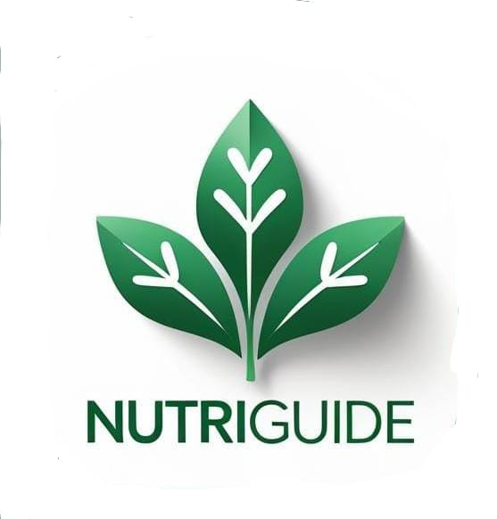

# NutriGuide 🥗

An AI-powered nutrition and diet coaching mobile application built with React Native and Expo. NutriGuide helps users maintain a healthy lifestyle through personalized diet guidance, meal planning, and progress tracking.



## ✨ Features

- **🤖 AI-Powered Nutrition Coach**: Get personalized nutrition advice powered by Google Gemini AI
- **📸 Food Recognition**: Scan food with your camera for instant calorie and nutrition analysis
- **📊 BMI Tracking**: Calculate and monitor your Body Mass Index with personalized recommendations
- **🍽️ Smart Food Tracking**: Log your meals and track daily calorie intake
- **📈 Progress Monitoring**: Track weight history and get AI-powered progress insights
- **💡 Personalized Meal Plans**: Receive customized meal suggestions based on your goals
- **🔄 Healthier Alternatives**: Get AI suggestions for healthier food alternatives
- **💬 Interactive AI Chat**: Ask nutrition questions and get expert guidance anytime
- **📱 Beautiful UI**: Modern, clean interface with green theme and smooth navigation

## 🚀 Getting Started

### Prerequisites

- Node.js (v14 or higher)
- npm or yarn
- Expo CLI
- Android device or emulator / iOS device or simulator
- Google Gemini API key

### Installation

1. Clone the repository:
```bash
git clone https://github.com/NextGenXplorer/NutriGuide.git
cd NutriGuide
```

2. Install dependencies:
```bash
npm install
```

3. Create a `.env` file in the root directory:
```env
GEMINI_API_KEY=your_gemini_api_key_here
```

4. Start the development server:
```bash
npm start
```

5. Scan the QR code with Expo Go app (Android/iOS) or run on emulator:
```bash
npm run android  # For Android
npm run ios      # For iOS
```

## 🔑 Getting Gemini API Key

1. Visit [Google AI Studio](https://makersuite.google.com/app/apikey)
2. Sign in with your Google account
3. Create a new API key
4. Copy the key and add it to your `.env` file

## 📱 Screenshots

### Home Screen
- Daily calorie goals and progress tracking
- AI-powered personalized motivation
- BMI analysis with health recommendations
- Macro distribution (Carbs, Protein, Fats)
- Today's meal plan suggestions

### Food Tracking
- Manual food entry with calorie input
- Camera integration for food scanning
- AI-powered food recognition
- Get healthier alternatives suggestions
- Daily nutrition summary

### Progress Tracking
- Current weight and BMI display
- Weight trend analysis
- 7-day weight history
- AI progress analysis with markdown insights
- Goal-based progress tips

### AI Chat
- Interactive nutrition coaching
- Context-aware conversations
- Markdown-formatted responses
- Quick question suggestions
- Personalized health advice

### About
- App information and features
- NextGenXplorer branding
- Social media links
- Contact information

## 🛠️ Tech Stack

- **Framework**: React Native with Expo
- **Language**: TypeScript
- **Navigation**: React Navigation (Stack & Bottom Tabs)
- **Storage**: AsyncStorage for local data persistence
- **AI Integration**: Google Generative AI (Gemini 2.0 Flash)
- **Camera**: Expo Camera & Image Picker
- **Markdown**: react-native-markdown-display
- **Icons**: @expo/vector-icons (Ionicons)

## 📂 Project Structure

```
NutriGuide/
├── src/
│   ├── navigation/
│   │   └── AppNavigator.tsx      # Navigation setup
│   ├── screens/
│   │   ├── OnboardingScreen.tsx  # User profile setup
│   │   ├── HomeScreen.tsx        # Dashboard with BMI & meal plans
│   │   ├── FoodTrackingScreen.tsx # Food logging & tracking
│   │   ├── ProgressScreen.tsx    # Weight & progress tracking
│   │   ├── AIChatScreen.tsx      # AI nutrition coach chat
│   │   └── AboutScreen.tsx       # App info & credits
│   ├── services/
│   │   ├── geminiService.ts      # AI integration
│   │   └── storage.ts            # AsyncStorage utilities
│   ├── utils/
│   │   ├── bmiCalculator.ts      # BMI calculations
│   │   └── mealPlanner.ts        # Meal planning logic
│   └── types/
│       ├── index.ts              # TypeScript interfaces
│       └── env.d.ts              # Environment types
├── assets/                        # App icons and images
├── .env                          # Environment variables (not in repo)
├── app.json                      # Expo configuration
├── package.json                  # Dependencies
└── tsconfig.json                 # TypeScript config
```

## 🎯 How It Works

### Onboarding
1. Enter your name, age, height, and weight
2. Select gender, activity level, and fitness goal
3. Choose dietary preferences (Vegetarian/Non-Vegetarian/Vegan)
4. Get personalized BMI analysis and calorie goals

### Daily Usage
1. **Track Your Food**: Log meals manually or scan with camera
2. **Monitor Progress**: Check your daily calorie consumption
3. **Get AI Insights**: Receive personalized nutrition tips
4. **Update Weight**: Log weight changes to track progress
5. **Chat with AI**: Ask nutrition questions anytime

## 🧮 BMI Calculation

NutriGuide uses the **Mifflin-St Jeor Equation** for accurate calorie calculation:

**For Men:**
```
BMR = (10 × weight in kg) + (6.25 × height in cm) - (5 × age) + 5
```

**For Women:**
```
BMR = (10 × weight in kg) + (6.25 × height in cm) - (5 × age) - 161
```

Daily calorie needs are adjusted based on:
- Activity level (sedentary to very active)
- Fitness goals (lose/maintain/gain weight)

## 🤖 AI Features

### Powered by Google Gemini

1. **Daily Motivation**: Personalized motivational messages based on your progress
2. **Meal Suggestions**: AI-generated meal ideas tailored to your diet and goals
3. **Food Recognition**: Scan food images to get instant nutritional information
4. **Progress Analysis**: Weekly insights with trends and recommendations
5. **Healthier Alternatives**: Get suggestions for healthier food swaps
6. **Interactive Chat**: Ask any nutrition-related questions

## 📊 Data Privacy

- All data is stored locally on your device using AsyncStorage
- No user data is sent to external servers except:
  - Food images sent to Gemini API for recognition
  - Chat messages sent to Gemini API for responses
- Your Gemini API key is stored securely in environment variables

## 🎨 Design

- **Color Scheme**: Green theme (#27ae60) representing health and vitality
- **Typography**: Clean, modern fonts for excellent readability
- **Icons**: Ionicons for consistent visual language
- **Layout**: Card-based UI with smooth navigation
- **Branding**: Circular app logo on all screen headers

## 📄 License

This project is open source and available under the MIT License.

## 👥 Credits

**Developed by**: [NextGenXplorer](https://github.com/NextGenXplorer)

**Connect with us:**
- GitHub: [NextGenXplorer](https://github.com/NextGenXplorer/)
- Instagram: [@nexgenxplorerr](https://www.instagram.com/nexgenxplorerr)
- WhatsApp: [Join Channel](https://whatsapp.com/channel/0029VaU05uG9RZAeiXKyEu06)
- Email: nxgextra@gmail.com

## 🤝 Contributing

Contributions, issues, and feature requests are welcome! Feel free to check the [issues page](https://github.com/NextGenXplorer/NutriGuide/issues).

## ⭐ Show Your Support

Give a ⭐️ if this project helped you!

## 🔮 Future Enhancements

- [ ] Multi-language support
- [ ] Recipe suggestions with cooking instructions
- [ ] Water intake tracking
- [ ] Exercise logging and calorie burn tracking
- [ ] Social features (share progress with friends)
- [ ] Meal photo gallery
- [ ] Export data to PDF/CSV
- [ ] Integration with fitness trackers
- [ ] Barcode scanning for packaged foods
- [ ] Grocery list generator

---

**Built with ❤️ using React Native, Expo, and Google Gemini AI**

🤖 *Generated with [Claude Code](https://claude.com/claude-code)*
